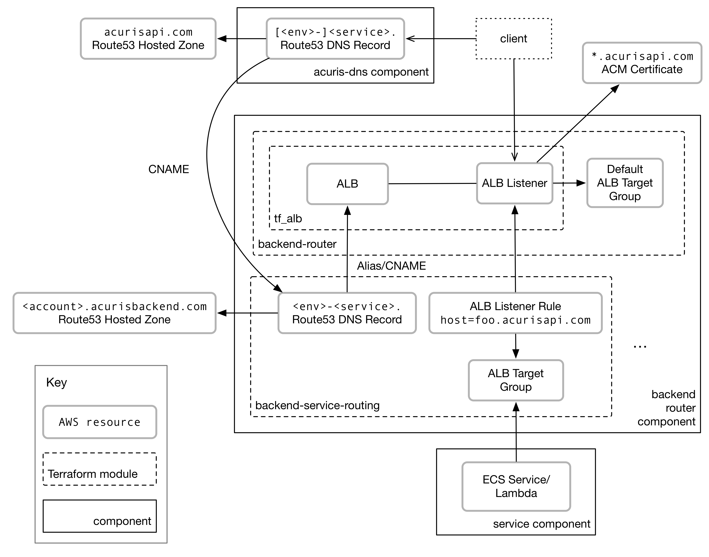

Backend Router Terraform module
===============================

[](https://travis-ci.org/mergermarket/terraform-acuris-backend-router)

This module creates a Backend Router service which, in effect, is a shared ALB to which individual services can be attached.
Ideally, there should be a single Backend Router per Team (e.g. platform-backend-router).

The Backend Router consists of:

- an ALB
- default, HTTPS Listener, with a certificate as per `dns_domain` parameter, by default diverting traffic to `404` ECS Service

Services attached to this ALB should be using `host-based` conditions for routing, rather than `path-based`.

Module Input Variables
----------------------

- `team` - (string) - **REQUIRED** - Name of Team deploying the ALB - will affect ALBs name
- `env` - (string) - **REQUIRED** - Environment deployed to
- `component` - (string) - **REQUIRED** - component name
- `platform_config` - (map) - **REQUIRED** - Mergermarket Platform config dictionary (see tests for example one)
- `certificate_domain_name` - (string) - **REQUIRED** - cert domain name to be used when looking up SSL Certificate
- `alb_internal` - (bool) - If true, the ALB will be internal (default: `true`)

Usage
-----

```hcl

module "backend_router" {
  source          = "mergermarket/backend-router/acuris"
  version         = "0.2.1"

  team                         = "footeam"
  env                          = "fooenv"
  component                    = "foocomponent"
  platform_config              = "${var.platform_config}"
  certificate_domain_name      = "domain.com"
}
```

Outputs
-------

- `alb_dns_name` - The DNS name of the load balancer
- `alb_arn` - The AWS ARN of the load balancer
- `alb_listener_arn` - The ARN of the load balancer listener
- `default_target_group_arn` - The ARN of the target group

Architecture
------------

This module is the `backend-router` box in the diagram below:

